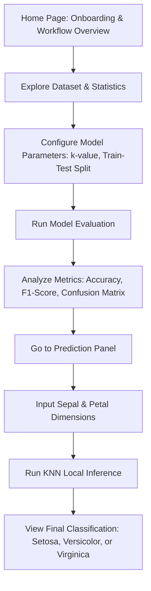
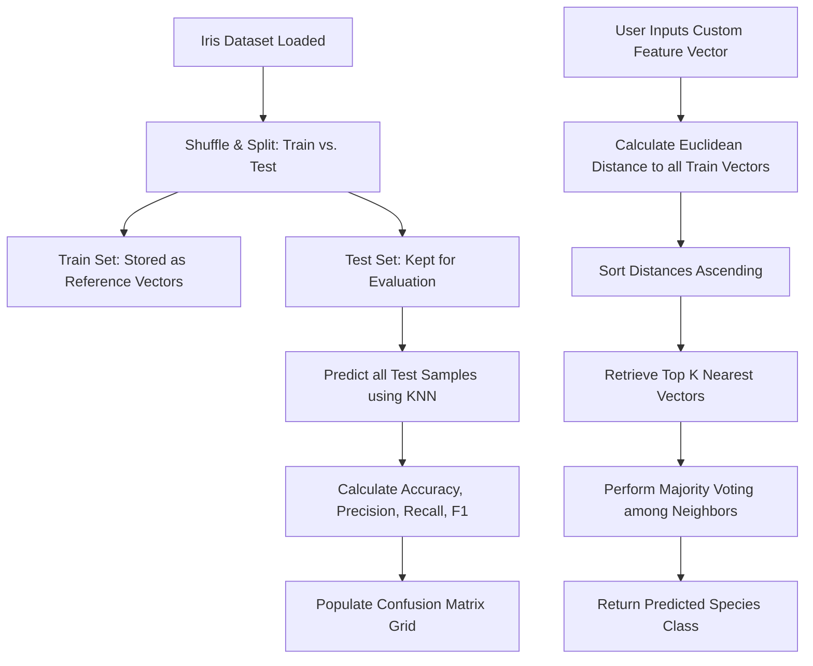

# BloomSphere Product Blueprint (Revised)

**BloomSphere** is an interactive, browser-based Machine Learning application that visualizes and executes supervised classification on the classic **Iris Flower Dataset** using the **K-Nearest Neighbors (KNN)** algorithm. It features a fully transparent, client-side execution engine, allowing users to tweak parameters, run model evaluations, visualize classification boundaries, and predict iris species in real-time.

---

## 1. Project Overview
This project is a dedicated educational dashboard demonstrating supervised machine learning concepts for an Artificial Intelligence internship. By implementing the K-Nearest Neighbors algorithm from scratch in vanilla JavaScript, the application operates entirely within the browser without requiring external APIs or Python backends. Users can inspect the Iris dataset, configure hyperparameters, view live performance metrics, and submit custom measurements to classify Iris flowers.

## 2. Core Objective
*   **Explainable Machine Learning:** Provide internship-level documentation on model mechanics (Euclidean distance, hyperparameter $k$, train-test splitting).
*   **Interactive Evaluation:** Allow real-time adjustments of the neighbor count ($k$) and train/test split ratio, instantly recalculating and displaying performance metrics.
*   **Visual Analysis:** Render the classification outcomes visually through a dynamic Confusion Matrix and scatter plots of features.
*   **Precise Classification:** Accept user-defined botanical parameters (sepal/petal lengths and widths) to output the predicted species along with a confidence breakdown of its nearest neighbors.

---

## 3. User Journey



1.  **Welcome & Onboarding:** The user learns about the supervised classification project, the Iris dataset, and the internship context.
2.  **Dataset Exploration:** The user views a table/summary of the 150 Iris instances, including statistical attributes (min, max, mean).
3.  **Model Configuration:** The user adjusts $k$ (number of neighbors) and the train/test split percentage using sliders.
4.  **Evaluation & Training:** Clicking "Evaluate Model" shuffles the dataset, splits it, runs KNN over the test set, and updates the accuracy, F1-scores, and confusion matrix.
5.  **Interactive Prediction:** The user enters 4 custom metrics (Sepal/Petal length and width) and observes the live prediction, showing exactly which neighbors voted for which class.

---

## 4. Feature List
*   **KNN Classifier Engine (Vanilla JS):** Complete, from-scratch implementation of the K-Nearest Neighbors classifier including Euclidean distance calculations and majority voting logic.
*   **Interactive Parameters Panel:** Custom control sliders for:
    *   Neighbor count ($k$) - typically adjustable from 1 to 15.
    *   Train/Test split percentage (e.g., 60% to 90% training data).
*   **Performance Metrics Dashboard:**
    *   **Accuracy Display:** Percentage of correct predictions on the test set.
    *   **Macro F1-Score:** Average harmonic mean of precision and recall across all three Iris classes.
*   **Dynamic $3 \times 3$ Confusion Matrix:** An interactive heat-mapped grid visualizing True Positives, False Positives, and False Negatives for *Iris Setosa*, *Iris Versicolor*, and *Iris Virginica*.
*   **Dataset Viewer:** Summary statistics and browseable grid of the 150 Iris dataset samples.
*   **Inference Playground:** Interactive inputs for Sepal Length, Sepal Width, Petal Length, and Petal Width to trigger real-time predictions.
*   **Visual Neighbor Vote Breakdown:** A small list/chart showing the distance and labels of the $k$ closest data points that determined the prediction.

---

## 5. Page Structure (Single Page Dashboard)
The app operates as a responsive single-page dashboard with a clean sidebar or top-nav structure, divided into four key sections:

*   **1. Home & Machine Learning Workflow:**
    *   Project introduction and step-by-step description of the supervised ML lifecycle (Data Collection -> Preprocessing -> Model Training -> Evaluation -> Deployment/Inference).
*   **2. Dataset Explorer:**
    *   Interactive data table displaying the Iris dataset.
    *   Summary metrics (Mean, Std Dev, Min, Max) for each of the 4 features.
*   **3. Model Training & Evaluation:**
    *   Control sliders for $k$-value and Train-Test split.
    *   "Run Evaluation" CTA.
    *   Metrics summary grids (Accuracy, F1-Score) and the heat-mapped **Confusion Matrix**.
*   **4. Species Predictor (Inference):**
    *   Numeric input fields/sliders for Sepal/Petal lengths and widths.
    *   Interactive "Predict Species" button.
    *   Species Card outcome (with corresponding illustrations/icons) and a visual list of voting neighbors.

---

## 6. UI Components
*   **Interactive Input Form:** Numerical input boxes with increment controls and safety bounds matching the Iris dataset range ($0.1\text{cm} - 8.0\text{cm}$).
*   **Heat-Mapped Confusion Matrix:** A CSS grid container representing actual vs. predicted labels. The background opacity of each grid cell correlates to its value, highlighting correct classifications in green and errors in red.
*   **Circular Progress Gauges:** Premium SVG-animated circular indicators displaying the model's accuracy and F1 score.
*   **KNN Math Visualizer Accordion:** An expandable panel illustrating the Euclidean distance formula:
    $$d(p, q) = \sqrt{(p_1-q_1)^2 + (p_2-q_2)^2 + (p_3-q_3)^2 + (p_4-q_4)^2}$$
*   **Result Announcement Banner:** A glassmorphism card that glows with a color unique to the predicted species (e.g., Setosa = Violet, Versicolor = Orange, Virginica = Teal).

---

## 7. Machine Learning Workflow


### Detailed Algorithm Steps in JavaScript:
1.  **Distance Calculation:**
    For a target point $x$ and training point $y$:
    ```javascript
    function euclideanDistance(x, y) {
      return Math.sqrt(
        Math.pow(x.sepalLength - y.sepalLength, 2) +
        Math.pow(x.sepalWidth - y.sepalWidth, 2) +
        Math.pow(x.petalLength - y.petalLength, 2) +
        Math.pow(x.petalWidth - y.petalWidth, 2)
      );
    }
    ```
2.  **Nearest Neighbor Selection:**
    *   Compute distance from the input point to every point in the training set.
    *   Sort the training points by distance in ascending order.
    *   Select the top $k$ items.
3.  **Voting:**
    *   Tally the classes of the top $k$ items.
    *   The class with the highest frequency wins. In case of a tie, default to the closest neighbor's class.

---

## 8. Recommended Tech Stack
*   **Core Logic & UI:** Vanilla HTML5, modern CSS3 (Variables, Flexbox, CSS Grid, Backdrop-Filters), and Vanilla ES6 JavaScript modules.
*   **Bundling/Development Server:** **Vite** (allows hot-module replacement and structures assets cleanly).
*   **Icon Library:** **Lucide Icons** (included via CDN or direct package install for crisp modern UI icons).
*   **Visualization:** Native Canvas API or pure HTML/CSS elements to construct charts and matrices dynamically (avoiding large external libraries like Chart.js to keep execution lightweight and fast).

---

## 9. Folder Structure
```text
BloomSphere/
├── index.html                  # Core application shell
├── package.json                # Project config and dependencies
├── vite.config.js              # Vite config
├── README.md                   # Setup guide and instructions
├── src/
│   ├── css/
│   │   └── style.css           # Core styling system (CSS variables, glassmorphism)
│   ├── js/
│   │   ├── main.js             # Navigation router & overall event listener
│   │   ├── dataset.js          # Raw Iris dataset array (150 objects)
│   │   ├── knn.js              # Custom KNN implementation (Euclidean distance, sorting, voting)
│   │   ├── evaluation.js       # Evaluates the test set, builds confusion matrix, calculates F1 & accuracy
│   │   └── ui.js               # Handles DOM updates, grids, charts, and metrics rendering
│   └── assets/
│       └── symbols/            # SVGs or custom icons for the 3 species
```

---

## 10. Future Enhancements
*   **Dimensionality Reduction Visualization:** Use PCA (Principal Component Analysis) or t-SNE in JavaScript to project 4D features onto a 2D scatter plot with dynamic boundary coloring.
*   **Alternative Distance Metrics:** Allow switching between Euclidean, Manhattan, and Chebyshev distances.
*   **Support Vector Machine (SVM) / K-Means Comparison:** Implement a second basic model to compare accuracy and metrics side-by-side.
*   **Dataset Upload:** Let users upload a custom `.csv` dataset (e.g., Wine or Breast Cancer dataset) and run classification on it using the same UI.
